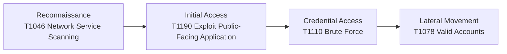

# KQL Purple Team Detection Rules

A collection of KQL detection rules for Microsoft Sentinel built from a purple team perspective, each rule maps a real attacker technique to a defensive detection, following the kill chain from reconnaissance to lateral movement.

## Project Philosophy

Most detection rules are written purely from a defensive mindset.

This project takes a different approach: I wrote these rules knowing exactly how the attacks work from the offensive side.

Having executed these techniques hands-on in HackTheBox machines and TryHackMe labs (eJPTv2, eSOC certified), I understand what signals each attack generates at the network and log level. That offensive knowledge is what makes these detections precise rather than generic.

This is purple team thinking in practice: red team knowledge, blue team output.

> "Detection engineering without offensive knowledge is just pattern matching. \
>  Understanding how attacks work is what makes detections reliable."

## Kill Chain Coverage

The rules are organized to follow a realistic attack progression:

| # | Phase            | Technique                      | MITRE | Rule                         |
|---|------------------|--------------------------------|-------|------------------------------|
| 1 | Reconnaissance   | Network Service Scanning       | T1046 | Network Scanning Detection   |
| 2 | Initial Access   | Exploit Public-Facing Application | T1190 | SQL Injection Detection    |
| 3 | Credential Access| Brute Force                    | T1110 | Brute Force Detection        |
| 4 | Lateral Movement | Valid Accounts                 | T1078 | Impossible Travel Detection  |



### The narrative 

An attacker scans for open services → finds a vulnerable web app → exploits SQLi for initial access → brute forces credentials → uses stolen credentials from another country. 

Each step in the kill chain has a corresponding detection rule.

## Repository Structure

```
KLG-PURPLE-DET-RULES/
├── README.md
├── MITRE-mapping.md
├── 01-reconnaissance/
│   └── network-scanning.kql
├── 02-initial-access/
│   └── sql-injection.kql
├── 03-credential-access/
│   └── brute-force.kql
└── 04-lateral-movement/
    └── impossible-travel.kql
```

## Rule 1: Network Scanning Detection

| Field    | Value                                     |
|----------|-------------------------------------------|
| File     | `01-reconnaissance/network-scanning.kql`  |
| MITRE    | T1046: Network Service Discovery         |
| Tactic   | Reconnaissance / Discovery                |
| Severity | Low / Medium / High (dynamic)             |

### What it detects

A source IP touching many distinct ports or hosts in a short time window, the classic pattern of `nmap -sS` or a full network sweep.

### Why it's built this way

Two dimensions are tracked simultaneously: port scan (vertical) and host sweep (horizontal). These indicate different attacker objectives and require different analyst responses. Filtering on denied/dropped traffic massively reduces noise from legitimate traffic.

### Key design decisions

- Variables at the top for easy threshold tuning without touching query logic
- `dcount(DestinationPort)` AND `dcount(DestinationIP)`, two independent signals
- `make_set(DestinationPort)` gives analysts context on what was targeted, not just a count
- Dynamic ScanType classification: Aggressive Port Scan vs Network Sweep vs Targeted Scan

```kql
let timeframe = 1h;
let portThreshold = 15;
let hostThreshold = 5;
CommonSecurityLog
| where TimeGenerated > ago(timeframe)
| where DeviceAction =~ "deny" or DeviceAction =~ "drop"
| summarize 
    DistinctPorts = dcount(DestinationPort),
    DistinctHosts = dcount(DestinationIP),
    PortList = make_set(DestinationPort, 20),
    FirstSeen = min(TimeGenerated),
    LastSeen = max(TimeGenerated)
    by SourceIP
| where DistinctPorts > portThreshold or DistinctHosts > hostThreshold
| extend DurationMinutes = datetime_diff('minute', LastSeen, FirstSeen)
| extend ScanType = case(
    DistinctPorts > 100, "Aggressive Port Scan (likely automated)",
    DistinctHosts > 20, "Network Sweep",
    "Targeted Scan")
| extend Severity = case(
    DistinctPorts > 100 or DistinctHosts > 20, "High",
    DistinctPorts > 50, "Medium",
    "Low")
| project SourceIP, DistinctPorts, DistinctHosts, DurationMinutes, 
          ScanType, Severity, PortList
| order by DistinctPorts desc
```

## Rule 2: SQL Injection Detection

| Field    | Value                                 |
|----------|---------------------------------------|
| File     | `02-initial-access/sql-injection.kql` |
| MITRE    | T1190: Exploit Public-Facing Application |
| Tactic   | Initial Access                        |
| Severity | Low / Medium / High (dynamic)         |

### What it detects

SQL injection payloads in IIS web server logs, from basic boolean-based attempts (`' OR 1=1`) to dangerous OS-level commands (`xp_cmdshell`).

### Why it's built this way

Attackers encode payloads to evade basic string matching. URL decoding before pattern matching is non-negotiable, without it, most real-world SQLi attempts would go undetected. The attack type classification matters because `xp_cmdshell` (RCE attempt) requires immediate escalation while `' OR 1=1` may just be a scanner.

### Key design decisions

- `url_decode()` applied before pattern matching: defeats encoding evasion
- Payload list as a variable: add new patterns without rewriting query logic
- `xp_cmdshell` and `DROP TABLE` always trigger High regardless of volume: intent matters more than count
- `make_set(DistinctPayloads)` preserves evidence for analyst investigation

```kql
let timeframe = 1h;
let sqlPatterns = dynamic([
    "' OR ", "' AND ", "1=1", "1 = 1",
    "UNION SELECT", "UNION ALL SELECT",
    "DROP TABLE", "INSERT INTO",
    "xp_cmdshell", "EXEC(",
    "CAST(", "CONVERT(",
    "information_schema", "sys.tables",
    "' --", "';--", "/*", "*/"
]);
W3CIISLog
| where TimeGenerated > ago(timeframe)
| where csMethod == "GET" or csMethod == "POST"
| extend DecodedQuery = url_decode(csUriQuery)
| extend DecodedStem = url_decode(csUriStem)
| where (
    (isnotempty(DecodedQuery) and DecodedQuery has_any (sqlPatterns)) or
    (isnotempty(DecodedStem) and DecodedStem has_any (sqlPatterns)) or
    (isnotempty(csUriQuery) and csUriQuery has_any (sqlPatterns))
)
| summarize
    AttackCount = count(),
    DistinctEndpoints = dcount(csUriStem),
    DistinctPayloads = make_set(DecodedQuery, 10),
    FirstSeen = min(TimeGenerated),
    LastSeen = max(TimeGenerated)
    by cIP, csHost
| extend DurationMinutes = datetime_diff('minute', LastSeen, FirstSeen)
| extend AttackType = case(
    DistinctEndpoints > 5, "Automated SQLi Scanner",
    DistinctPayloads has "UNION SELECT", "Union-Based SQLi",
    DistinctPayloads has "1=1", "Boolean-Based SQLi",
    DistinctPayloads has "xp_cmdshell", "OS Command Injection via SQLi",
    "Generic SQLi Attempt")
| extend Severity = case(
    DistinctPayloads has "xp_cmdshell" or DistinctPayloads has "DROP TABLE", "High",
    AttackCount > 50 or DistinctEndpoints > 5, "Medium",
    "Low")
| project cIP, csHost, AttackCount, DistinctEndpoints,
          AttackType, Severity, DurationMinutes, DistinctPayloads
| order by Severity asc, AttackCount desc
```

## Rule 3: Brute Force Detection

| Field    | Value                                             |
|----------|---------------------------------------------------|
| File     | `03-credential-access/brute-force.kql`            |
| MITRE    | T1110: Brute Force (T1110.001 Password Guessing, T1110.003 Password Spraying) |
| Tactic   | Credential Access                                 |
| Severity | Low / Medium / High (dynamic)                     |

### What it detects

Excessive failed authentication attempts against Azure AD / Entra ID accounts within a one-hour window, distinguishing between a forgetful user and an automated attack.

### Why it's built this way

The DistinctIPs dimension is the key differentiator: one IP with many failures suggests a targeted attack or forgotten password; many IPs with one failure each is password spraying, a completely different technique requiring a different response. Dynamic severity automates analyst triage.

### Key design decisions

- 1-hour window balances fast detection with noise reduction
- `dcount(IPAddress)` as secondary signal separates attack types
- `datetime_diff` on first/last attempt distinguishes automated (fast) from manual (slow)
- Dynamic severity: >50 attempts = High, >20 = Medium, else Low

```kql
SigninLogs
| where TimeGenerated > ago(1h)
| where ResultType != "0"
| summarize FailedAttempts = count(), 
            DistinctIPs = dcount(IPAddress),
            FirstAttempt = min(TimeGenerated),
            LastAttempt = max(TimeGenerated)
            by UserPrincipalName, AppDisplayName
| where FailedAttempts > 10
| extend TimeDeltaMinutes = datetime_diff('minute', LastAttempt, FirstAttempt)
| extend Severity = case(
    FailedAttempts > 50, "High",
    FailedAttempts > 20, "Medium",
    "Low")
| project UserPrincipalName, FailedAttempts, DistinctIPs, 
          TimeDeltaMinutes, Severity, AppDisplayName
| order by FailedAttempts desc
```

## Rule 4: Impossible Travel Detection

| Field    | Value                                     |
|----------|-------------------------------------------|
| File     | `04-lateral-movement/impossible-travel.kql` |
| MITRE    | T1078, Valid Accounts (T1078.004 Cloud Accounts) |
| Tactic   | Defense Evasion / Persistence / Lateral Movement |
| Severity | Low / Medium / High (dynamic)             |

### What it detects

A user successfully authenticating from two geographically impossible locations in too short a time, a strong indicator of compromised credentials being used by an attacker from another country.

### Why it's built this way

This detection targets T1078 (Valid Accounts), one of the hardest techniques to detect because the attacker uses legitimate credentials with no malware or exploits involved. Geographic impossibility is one of the few reliable signals. The Haversine formula calculates real Earth-surface distance rather than a flat approximation, which would give incorrect results for long distances.

### Key design decisions

- Only successful logins (`ResultType == "0"`), failed attempts are irrelevant here
- Haversine formula for mathematically correct distance calculation on Earth's surface
- `serialize` + `prev()` to compare consecutive logins from the same user
- Speed threshold as a variable (900 km/h = commercial flight), adjustable per organization
- Severity based on required speed: >5000 km/h = High (intercontinental in minutes)

```kql
let timeframe = 24h;
let travelSpeed = 900.0;
SigninLogs
| where TimeGenerated > ago(timeframe)
| where ResultType == "0"
| where isnotempty(LocationDetails)
| extend 
    Latitude = toreal(LocationDetails.geoCoordinates.latitude),
    Longitude = toreal(LocationDetails.geoCoordinates.longitude),
    Country = tostring(LocationDetails.countryOrRegion),
    City = tostring(LocationDetails.city)
| where isnotempty(Latitude) and isnotempty(Longitude)
| project TimeGenerated, UserPrincipalName, IPAddress,
          Latitude, Longitude, Country, City, AppDisplayName
| sort by UserPrincipalName asc, TimeGenerated asc
| serialize
| extend
    PrevLatitude = prev(Latitude, 1),
    PrevLongitude = prev(Longitude, 1),
    PrevCountry = prev(Country, 1),
    PrevCity = prev(City, 1),
    PrevTime = prev(TimeGenerated, 1),
    PrevUser = prev(UserPrincipalName, 1)
| where UserPrincipalName == PrevUser
| where Country != PrevCountry
| extend TimeDeltaHours = datetime_diff('minute', TimeGenerated, PrevTime) / 60.0
| where TimeDeltaHours > 0
| extend DistanceKm = 6371 * 2 * asin(sqrt(
    pow(sin((Latitude - PrevLatitude) * pi() / 360), 2) +
    cos(PrevLatitude * pi() / 180) * cos(Latitude * pi() / 180) *
    pow(sin((Longitude - PrevLongitude) * pi() / 360), 2)))
| extend RequiredSpeedKmh = DistanceKm / TimeDeltaHours
| where RequiredSpeedKmh > travelSpeed
| extend Severity = case(
    RequiredSpeedKmh > 5000, "High",
    RequiredSpeedKmh > 2000, "Medium",
    "Low")
| project
    UserPrincipalName,
    PrevCity, PrevCountry, PrevTime,
    City, Country, TimeGenerated,
    TimeDeltaHours = round(TimeDeltaHours, 1),
    DistanceKm = round(DistanceKm, 0),
    RequiredSpeedKmh = round(RequiredSpeedKmh, 0),
    Severity, AppDisplayName, IPAddress
| order by RequiredSpeedKmh desc
```

## MITRE ATT&CK Coverage

| Tactic                                    | Technique                          | Sub-technique | Rule              |
|-------------------------------------------|------------------------------------|---------------|-------------------|
| Reconnaissance                            | T1046 Network Service Discovery    | —             | Network Scanning  |
| Initial Access                            | T1190 Exploit Public-Facing Application | —         | SQL Injection     |
| Credential Access                         | T1110 Brute Force                  | T1110.001, T1110.003 | Brute Force    |
| Defense Evasion / Lateral Movement        | T1078 Valid Accounts               | T1078.004     | Impossible Travel |

## Prerequisites

- Microsoft Sentinel workspace
- Connected data sources:
  - `SigninLogs` Azure AD / Entra ID connector
  - `CommonSecurityLog` Firewall/Network device connector (CEF)
  - `W3CIISLog` IIS Web Server connector
- KQL knowledge (SC-200 level)

## Author

**Jorge Campos Bellido**

> SOC Analyst | Security Operations & Penetration Testing \
> eJPTv2 & eSOC Certified (INE Security) | Google Cybersecurity

- [LinkedIn](#)
- [Portfolio](#)
